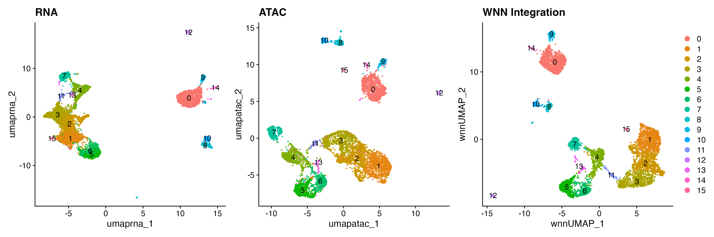
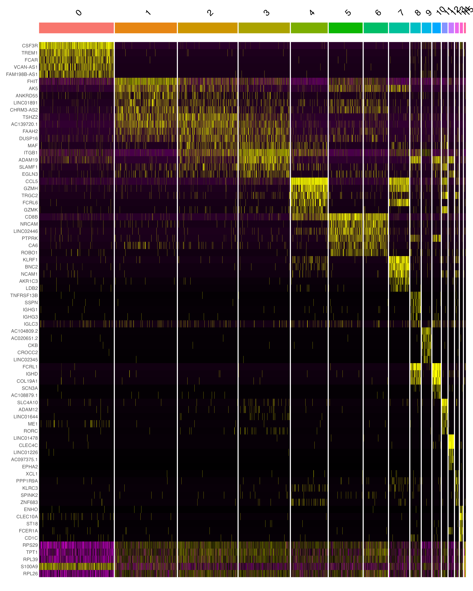

# Single-Cell Multiomics Integration: RNA-seq and ATAC-seq Analysis

[](https://www.r-project.org/)
[](https://satijalab.org/seurat/)
[](https://stuartlab.org/signac/)
[](https://opensource.org/licenses/MIT)

## Overview

Integrated analysis pipeline for single-cell multiomics data, combining RNA-seq (gene expression) and ATAC-seq (chromatin accessibility) to identify cell types and their regulatory mechanisms. This project implements Weighted Nearest Neighbor (WNN) integration for superior cell type identification.


*Comparison of RNA-only, ATAC-only, and WNN integration clustering*

## Key Features

- **Dual-modality analysis**: Simultaneous RNA and ATAC-seq processing from the same cells
- **Comprehensive QC**: Multi-metric filtering for both modalities (TSS enrichment, nucleosome signal, mitochondrial percentage)
- **WNN Integration**: State-of-the-art algorithm that learns optimal weights for each modality per cell
- **Statistical rigor**: Differential expression and accessibility analysis with FDR correction
- **Visualizations**: UMAPs, heatmaps, and dot plots

## Results Summary

- **Starting cells**: 11,909
- **High-quality cells after QC**: 4,915 (41% pass rate)
- **RNA features analyzed**: 36,601 genes
- **ATAC features analyzed**: 108,377 chromatin accessibility peaks
- **Quality control**: Rigorous filtering retained only high-quality cells

## Technologies Used

- **R 4.5.2** - Statistical computing and data analysis
- **Seurat v5** - Single-cell RNA-seq analysis framework
- **Signac v1.16** - Chromatin accessibility analysis
- **Bioconductor** - Genomic data structures (GenomicRanges, BSgenome, EnsDb)
- **ggplot2** - Data visualization
- **dplyr** - Data manipulation and transformation

## Workflow
```
10x Multiome Data (RNA + ATAC)
          ↓
    Quality Control
    • RNA: gene counts, mitochondrial %
    • ATAC: TSS enrichment, nucleosome signal
    • Filtered 59% of low-quality cells
          ↓
    Normalization & Processing
    • RNA: PCA dimensionality reduction
    • ATAC: LSI dimensionality reduction
          ↓
    WNN Integration
    • Learns optimal weights per cell
    • Combines both modalities
          ↓
    Clustering & Visualization
    • Graph-based clustering
    • UMAP projection
          ↓
    Marker Identification
    • Differential gene expression
    • Differential chromatin accessibility
```

## Installation

### Prerequisites
```r
# Install CRAN packages
install.packages(c("Seurat", "Signac", "ggplot2", "dplyr", "patchwork"))

# Install Bioconductor packages
if (!require("BiocManager", quietly = TRUE))
    install.packages("BiocManager")

BiocManager::install(c(
  "GenomicRanges",
  "GenomeInfoDb",
  "rtracklayer",
  "EnsDb.Hsapiens.v86",
  "BSgenome.Hsapiens.UCSC.hg38"
))
```

### Exploring the Results
```r
# View marker genes
markers <- read.csv("results/rna_cluster_markers.csv")
head(markers)

# View top markers for quick reference
top_markers <- read.csv("results/top10_rna_markers.csv")
print(top_markers)

# View ATAC markers
atac_markers <- read.csv("results/atac_cluster_markers.csv")
head(atac_markers)
```

## Key Results

### 1. Multi-Modal Integration


The figure shows three clustering approaches:
- **Left**: RNA-only clustering based on gene expression
- **Center**: ATAC-only clustering based on chromatin accessibility
- **Right**: WNN integrated clustering (optimal approach)

**Key finding**: WNN integration reveals clearer cell type separation by optimally combining information from both data modalities.

### 2. Cell Type Markers



Heatmap displaying the top 5 marker genes for each cluster, showing distinct expression patterns that define cell identities.

### 3. Comprehensive Results Files

All analysis results are available in this repository:

**Marker Gene Tables:**
- `rna_cluster_markers.csv` - Complete list of differentially expressed genes per cluster with full statistics
- `top10_rna_markers.csv` - Top 10 marker genes for each cluster (quick reference for cell type identification)
- `atac_cluster_markers.csv` - Differentially accessible chromatin peaks per cluster

**Analysis Metadata:**
- `analysis_summary.txt` - Complete summary statistics, cell counts, and analysis parameters
- `session_info.txt` - R session info with all package versions for full reproducibility

## File Descriptions

| File | Description |
|------|-------------|
| `rna_cluster_markers.csv` | All differentially expressed genes per cluster with statistics |
| `atac_cluster_markers.csv` | All differentially accessible peaks per cluster |
| `top10_rna_markers.csv` | Top 10 marker genes per cluster for quick cell type identification |
| `umap_comparison.png` | Three-way comparison of RNA, ATAC, and WNN clustering |
| `marker_heatmap.png` | Heatmap of top marker genes showing distinct patterns |
| `analysis_summary.txt` | Summary statistics, cell counts, and analysis metadata |
| `session_info.txt` | Complete R package versions for reproducibility |

**Note**: The processed Seurat object (`.rds` file, ~150MB) is not included in this repository due to GitHub's file size limitations. The CSV files contain all key results and statistical findings.

## Understanding the Results

### Reading Marker Gene Tables

Each marker gene CSV contains the following columns:

| Column | Description |
|--------|-------------|
| `cluster` | Cluster number (0, 1, 2, ...) |
| `gene` | Gene symbol |
| `avg_log2FC` | Log2 fold-change in expression (>1 = 2x higher, >2 = 4x higher) |
| `pct.1` | Percentage of cells expressing the gene in this cluster |
| `pct.2` | Percentage of cells expressing the gene in other clusters |
| `p_val` | Raw p-value |
| `p_val_adj` | Adjusted p-value (FDR corrected, significant if <0.05) |

**Example interpretation:**
- Gene with `avg_log2FC = 2.5` is ~5.7× more highly expressed in the cluster
- Gene with `pct.1 = 0.90, pct.2 = 0.10` is expressed in 90% of cluster cells vs. 10% elsewhere
- Only genes with `p_val_adj < 0.05` are statistically significant

### Cell Type Identification Guide

Use marker genes to identify cell types by comparing to known markers:

**Common immune cell markers (if analyzing PBMC data):**
- **T cells**: CD3D, CD3E, CD8A (cytotoxic), CD4 (helper)
- **B cells**: CD79A, MS4A1, CD19
- **Monocytes**: CD14, FCGR3A
- **NK cells**: NKG7, GNLY, NCAM1

**Resources for cell type annotation:**
- [CellMarker Database](http://biocc.hrbmu.edu.cn/CellMarker/)
- [PanglaoDB](https://panglaodb.se/)
- Published literature for your specific tissue type

## Technical Highlights

### Quality Control Strategy

**RNA Quality Metrics:**
- Minimum genes per cell: >200
- Maximum genes per cell: <5,000 (filters doublets)
- Mitochondrial percentage: <10% (filters dying cells)

**ATAC Quality Metrics:**
- Fragment count range: 1,000-50,000 per cell
- TSS enrichment: >1 (signal enrichment at transcription start sites)
- Nucleosome signal: <2 (measures signal-to-noise ratio)

**Outcome**: Filtered 59% of cells (6,629 removed), retaining 4,915 high-quality cells

### Weighted Nearest Neighbor Integration

**Why WNN outperforms single-modality analysis:**

Traditional approaches analyze RNA and ATAC separately, potentially missing:
- Cells defined primarily by regulatory state (high ATAC weight)
- Cells defined primarily by transcriptional activity (high RNA weight)
- Complex regulatory relationships between the modalities

**WNN algorithm:**
1. Computes cell-cell similarity in RNA space (using PCA)
2. Computes cell-cell similarity in ATAC space (using LSI)
3. Learns optimal per-cell weights for each modality
4. Combines similarities into unified nearest-neighbor graph
5. Performs clustering on integrated graph

**Result**: More robust cell type identification that leverages both data types optimally.

### Statistical Methods

- **Dimensionality reduction**: PCA (RNA), LSI (ATAC)
- **Clustering**: Graph-based Louvain algorithm
- **Visualization**: UMAP projection
- **Differential expression**: Wilcoxon rank-sum test
- **Differential accessibility**: Logistic regression with sequencing depth correction
- **Multiple testing correction**: Benjamini-Hochberg FDR

### Technical Challenges Overcome

1. **Genomic coordinate system compatibility**
   - Issue: ChromatinAssay validation errors with seqinfo
   - Solution: Manual seqinfo assignment and direct slot manipulation

2. **Large-scale data handling**
   - Dataset: 144,978 features × 11,909 cells (>1.7 billion data points)
   - Solution: Efficient sparse matrix operations

3. **Multi-modal subsetting**
   - Issue: Standard subsetting failed for ChromatinAssay
   - Solution: Custom workflow with assay reconstruction

## Data Source

This analysis uses **10x Genomics Chromium Single Cell Multiome ATAC + Gene Expression** technology, which simultaneously measures:
- Gene expression (scRNA-seq) from ~20,000-40,000 genes
- Chromatin accessibility (scATAC-seq) from ~100,000-200,000 genomic regions
- From the same individual cells

**Required input files:**
- `filtered_feature_bc_matrix.h5` - Combined RNA and ATAC count matrix
- `atac_peaks.bed` - Called chromatin accessibility peaks
- `atac_fragments.tsv.gz` - Raw ATAC fragment file
- `atac_fragments.tsv.gz.tbi` - Fragment file index

**Example datasets** are freely available from [10x Genomics](https://www.10xgenomics.com/resources/datasets).


### Key Tool Citations

- **Seurat & WNN**: Hao et al. (2021). Integrated analysis of multimodal single-cell data. *Cell*, 184(13), 3573-3587.
- **Signac**: Stuart et al. (2021). Single-cell chromatin state analysis with Signac. *Nature Methods*, 18(11), 1333-1341.
- **10x Multiome**: 10x Genomics (2021). Chromium Single Cell Multiome ATAC + Gene Expression.

## Future Directions

Potential extensions of this analysis:

1. **Peak-to-gene linking**: Connect regulatory elements to target genes
2. **Motif enrichment analysis**: Identify active transcription factors
3. **Trajectory inference**: Map developmental or differentiation pathways
4. **Integration with additional datasets**: Compare to published cell atlases
5. **Functional validation**: Experimental validation of key regulatory elements

## Contact

**Venkata Pradeep Kumar Athota**  
📧 Email: pradeepathota3@gmail.com  
 

## License

This project is licensed under the MIT License - see the [LICENSE](LICENSE) file for details.

## Acknowledgments

- **10x Genomics** for Multiome technology and publicly available datasets
- **Satija Lab** (NYU) for developing Seurat and the WNN algorithm
- **Stuart Lab** (Stanford) for developing Signac
- **Bioconductor community** for genomic analysis tools

---

⭐ **If you found this project useful, please consider starring the repository!**

📊 **See `analysis_summary.txt` for detailed analysis statistics**

🔬 **All result files are available in the repository for full transparency**
